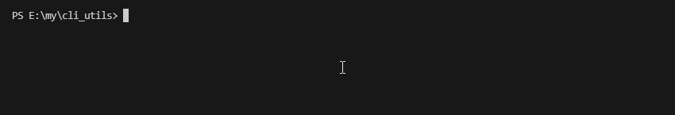

# cli_cli
使用node实现的各种命令行工具

## 工具清单

| 工具               | 文档                                  |
| ------------------ | ------------------------------------- |
| 进度条 ProgressBar | [使用文档](./src/docs/ProgressBar.md) |
|                    |                                       |
|                    |                                       |

## ProgressBar（进度条）

