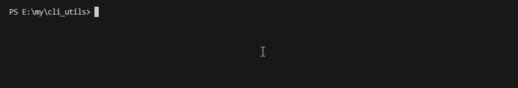

# ProgressBar（进度条）



## 基本使用

```typescript
import chalk from 'chalk'
import ProgressBar from "../utils/ProgressBar.js"

function run() {

  const progressBar = new ProgressBar({
    format: '下载中: {progress} {percent}% | 文件总数：{total} | 已下载：{value} | 速度：{speed}Kb/s',
    barCompleteChar: chalk.bgCyan(' ')
  })

  let value = 0
  const total = 50

  progressBar.start(total, value, {
    speed: 0
  })
  const timer = setInterval(() => {

    progressBar.update(++value, {
      speed: parseFloat((Math.random() * 100).toFixed(2))
    })

    if(value >= total) {
      clearInterval(timer)
    }

  }, 100)
}
run()
```


## 配置项 ProgressBarOptions

| 配置项            | 描述                                                         | 类型   | 是否必填 | 默认值                        |
| ----------------- | ------------------------------------------------------------ | ------ | -------- | ----------------------------- |
| format            | 输出的内容格式。有内置的变量定义如`{progress}`等，也支持可以自定义变量，在更新数值时传入即可。 | string | 否       | '进度：{progress} {percent}%‘ |
| barCompleteChar   | 进度条完成部分的字符                                         | string | 否       | ' '                           |
| barIncompleteChar | 进度条未完成部分的字符                                       | string | 否       | ░                             |

## 

## 方法 Function

| 方法        | 描述                                                         | 类型                                                         |
| ----------- | ------------------------------------------------------------ | ------------------------------------------------------------ |
| start       | 初始化一个进度条，需要传入初始的`进度值`和`总量`，可选传入其他自定义变量 | `Function(initTotal: number, initValue: number, otherVariable?: OtherVariable)` |
| update      | 更新数值，需要传入最新值，可选传入其他自定义变量             | `Function(newValue: number, otherVariable?: OtherVariable)`  |
| clearScreen | 清屏操作                                                     | Function                                                     |

